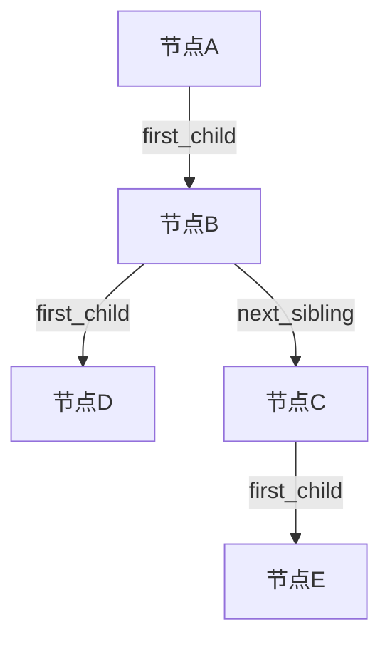

# Tree-Stats: 树形结构信息统计器

一个用C语言实现的、高效的通用树形结构库，支持多种统计功能和遍历算法。

## 功能特性

- **通用树表示**：采用“孩子-兄弟链表”法，可表示任意度数的树。
- **核心统计**：计算节点总数、叶子节点数、树的高度/深度。
- **完整遍历**：支持先序、后序、层序遍历。
- **内存安全**：所有动态分配的内存均有对应释放，确保无泄漏。
- **数据驱动**：可从文本文件格式构建树，便于测试。

## 项目结构
```
tree-stats/
├── main.c          # 测试程序入口
├── tree.h          # 头文件，包含树节点结构体定义和所有API函数声明
├── tree.c          # 源文件，包含所有API函数的具体实现
├── README.md       # 本项目说明文档
└── .gitignore     
```
## 核心数据结构可视化

本项目最核心的设计是**“孩子-兄弟链表表示法”**。每个节点只包含两个指针：`first_child` 指向其第一个子节点，`next_sibling` 指向其下一个兄弟节点。

下图清晰展示了其连接逻辑：



**指针关系解读**：
- **蓝色垂直链路** (`first_child`)：构建父子关系，形成树的主干。
- **橙色水平链路** (`next_sibling`)：将同一父节点的所有孩子串联成一个链表。
