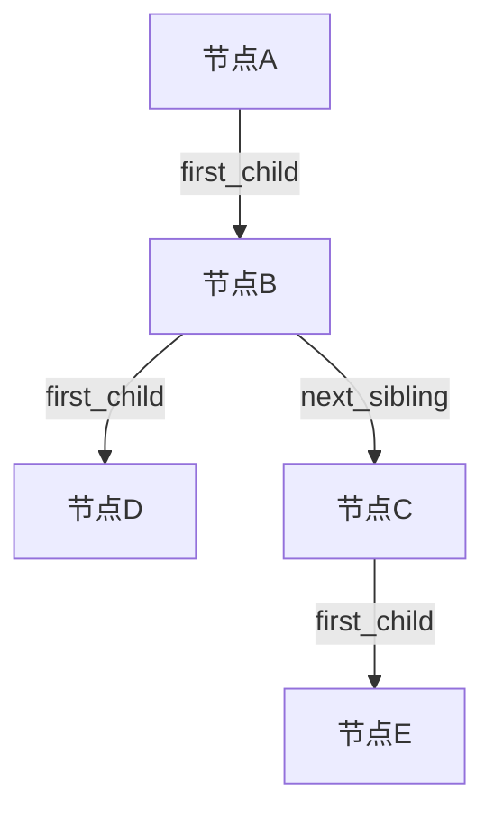
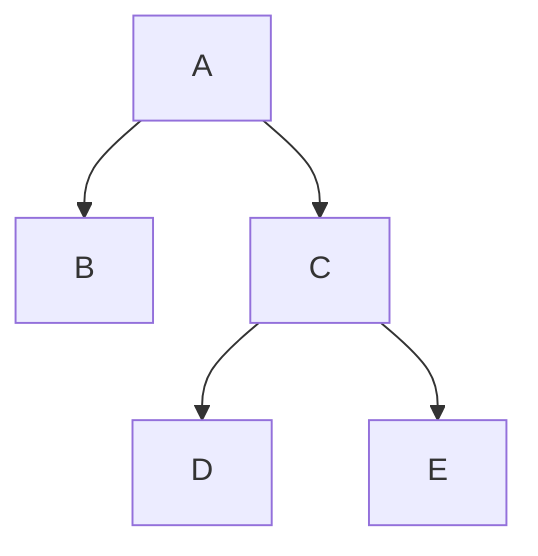
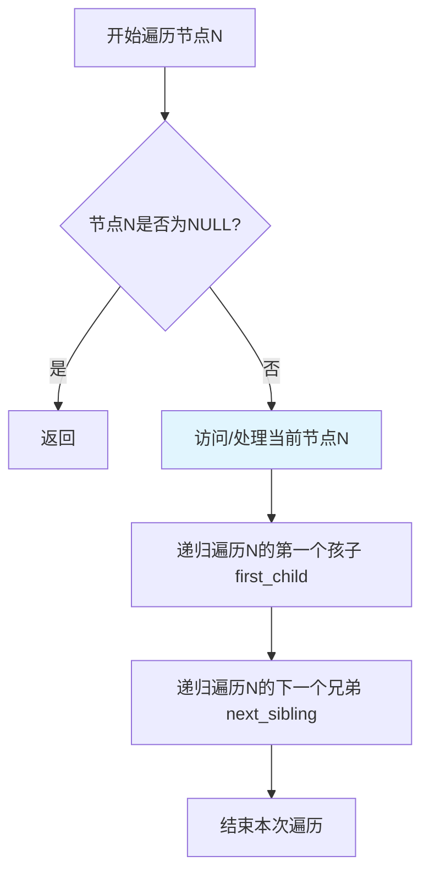
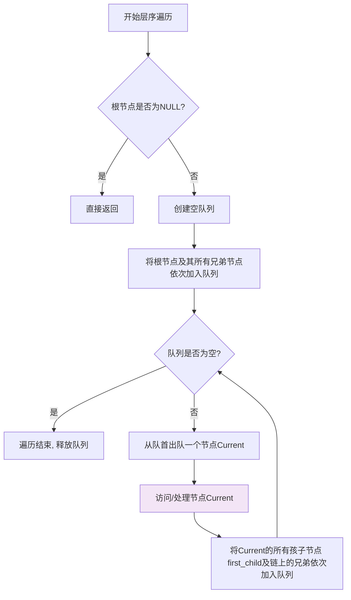
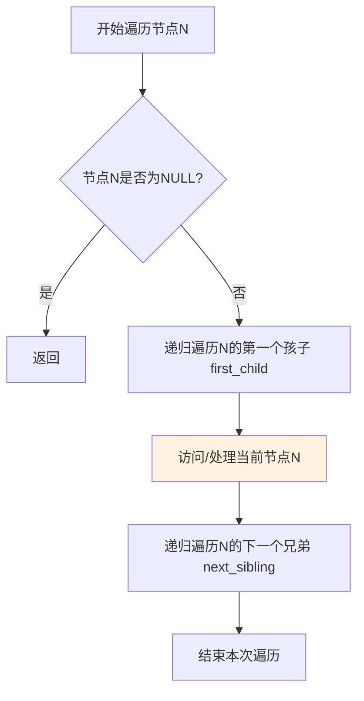

# Tree-Stats: 树形结构信息统计器

一个用C语言实现的、高效的通用树形结构库，支持多种统计功能和遍历算法。

## 功能特性

- **通用树表示**：采用“孩子-兄弟链表”法，可表示任意度数的树。
- **核心统计**：计算节点总数、叶子节点数、树的高度/深度。
- **完整遍历**：支持先序、后序、层序遍历。
- **内存安全**：所有动态分配的内存均有对应释放，确保无泄漏。
- **数据驱动**：可从文本文件格式构建树，便于测试。

## 项目结构
```
tree-stats/
├── main.c          # 测试程序入口
├── tree.h          # 头文件，包含树节点结构体定义和所有API函数声明
├── tree.c          # 源文件，包含所有API函数的具体实现
├── README.md       # 本项目说明文档
└── .gitignore     
```
## 核心数据结构可视化

本项目最核心的设计是**“孩子-兄弟链表表示法”**。每个节点只包含两个指针：`first_child` 指向其第一个子节点，`next_sibling` 指向其下一个兄弟节点。

下图清晰展示了其连接逻辑：



## 功能演示：两种数据输入方式

本项目提供两种输入方式来构建树结构：**交互式控制台输入**和**结构化文件读取**。

### 1. 交互式控制台输入
程序运行时，会引导您以**先序遍历**的顺序输入节点。输入 `#` 表示空节点。

**示例：构建下图中的树**


*（上述树的可视化结构）*

在程序提示下，您需要按顺序输入以下内容（每行输入后按回车）：
```
A
B
#
#
C
D
#
#
E
#
#
```
**输入序列详解**：这对应了树的先序遍历顺序 `A (B (空, 空), C (D (空, 空), E (空, 空)))`。

### 2. 从文件读取
树结构可预先定义在一个文本文件（如 `tree_data.txt`，树结构可自拟）中，程序可直接读取并构建。

**文件格式说明**：
1. 第一行：一个整数 `N`，表示树中节点总数。
2. 后续 N 行：每行描述一个节点，格式为 `数据 左子节点索引 右子节点索引`。
   - **索引从0开始**，即第一行数据对应索引0，第二行对应索引1，依此类推。
   - 索引 `-1` 表示对应的子节点为空。

**本项目选择的示例文件 `tree_data.txt` 内容**：
```
5
A 1 -1
B 2 3
C 4 -1
D -1 -1
E -1 -1
```

## 核心算法实现解释

本项目实现了多种树操作算法，以下是各关键函数的说明：

### 1. 节点创建：`tree_create_node`
```text
函数：tree_create_node(const char* data)
目标：创建并初始化一个新的树节点
步骤：
1. 参数检查：如果 data 为空，返回 NULL
2. 分配节点内存
3. 复制节点数据字符串
4. 初始化指针 (first_child, next_sibling 为 NULL)
5. 返回新节点
```
### 2. 文件构建树：`buildTreeFromFile`
```text
函数：buildTreeFromFile(const char* filename)
目标：从文本文件读取并构建树结构
步骤：
1.打开文件，读取节点总数 n
2.分配辅助数组：节点指针、子索引、兄弟索引
3.循环读取每个节点的数据和关系索引
4.创建所有节点
5.根据索引连接 first_child 和 next_sibling 指针
6.验证索引合法性，释放辅助数组
7.返回根节点
错误处理：任何步骤失败都进行完整清理
```
### 3. 树销毁：`tree_destroy`
```text
函数：tree_destroy(TreeNode* root)
目标：递归释放整棵树的内存
步骤：
1.如果根为空，直接返回
2.递归销毁所有子树
3.递归销毁所有兄弟节点
4.释放节点数据字符串
5.释放节点结构体
特点：后序遍历，确保无内存泄漏
```
### 4. 节点计数：`tree_node_count`
```text
函数：tree_node_count(TreeNode* root)
目标：统计树中总节点数
步骤：
1.根为空则返回0
2.返回：1 + 左子树节点数 + 右兄弟节点数
时间复杂度：O(n)，每个节点访问一次
```
### 5. 叶子计数：`tree_leaf_count`
```text
函数：tree_leaf_count(TreeNode* root)
目标：统计叶子节点数
步骤：
1.根为空则返回0
2.如果是叶子（无子节点）：返回1+兄弟叶子数
3.如果不是叶子：返回子树叶子数+兄弟叶子数
```
### 6. 树深度：`tree_depth`
```text
函数：tree_depth(TreeNode* root)

目标：计算树的最大深度
步骤：
1.根为空则返回0
2.计算子树深度：1 + tree_depth(first_child)
3.计算兄弟树深度：tree_depth(next_sibling)
4.返回两者中的最大值
注：兄弟节点不增加深度计数
```
### 7. 树度数：`tree_degree`
```text
函数：tree_degree(TreeNode* root)
目标：计算树的最大度（最大子节点数）
步骤：
1.根为空则返回0
2.计算当前节点度数（first_child链长度）
3.递归计算子树最大度
4.递归计算兄弟树最大度
5.返回三者最大值
```
### 8. 节点查找：`tree_find_node`
```text
函数：tree_find_node(TreeNode* root, const char* data)
目标：查找包含指定数据的节点
步骤：
1.根为空或数据为空则返回NULL
2.当前节点匹配则返回
3.在子树中递归查找
4.在兄弟节点中递归查找
搜索策略：深度优先，兄弟次之
```
### 9. 先序遍历：`tree_pre_order`

```text
函数：tree_pre_order(TreeNode* root)
目标：先序遍历树
步骤：
1.根为空则返回
2.访问当前节点
3.递归遍历所有子树
4.递归遍历所有兄弟节点
遍历顺序：根 → 子 → 兄
```
### 10. 层序遍历：`tree_level_order`

```text
函数：tree_level_order(TreeNode* root)
目标：按层遍历树
步骤：
1.创建队列，根节点入队
2.当队列非空：
a. 出队一个节点
b. 访问该节点
c. 该节点的所有子节点入队
3.兄弟节点在同一层顺序访问
数据结构：使用队列辅助
```
### 11. 后序遍历算法

后序遍历采用深度优先策略，访问顺序为：**先递归遍历所有子节点，再访问当前节点，最后递归遍历兄弟节点**。

```text
函数：tree_postorder(const TreeNode* root, void (*visit)(const TreeNode*))
输入：root - 树根节点，visit - 访问节点的回调函数
输出：无
步骤：
1. 如果 root == NULL，返回
2. 递归调用 tree_postorder(root->first_child, visit)
3. 调用 visit(root) 处理当前节点
4. 递归调用 tree_postorder(root->next_sibling, visit)
```
### 12. 树形打印：`tree_print`
```text
函数：tree_print(TreeNode* root)
目标：以树形格式打印树结构
步骤：
1.调用递归辅助函数
2.使用前缀字符串表示层级关系
符号说明："│  "表示连接线，"/"表示分支，"\"表示最后分支
递归打印所有子节点和兄弟节点
输出：直观的ASCII树形图
```
